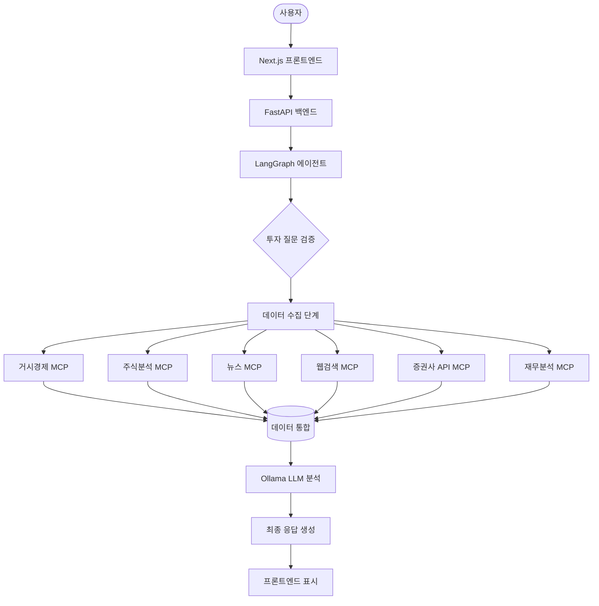

# 🤖 AI MCP A2A - AI 에이전트 시스템

> **LangGraph + FastMCP + Docker** 기반의 실시간 AI 에이전트 포트폴리오

[](https://nextjs.org/)
[](https://github.com/jlowin/fastmcp)
[](https://langchain-ai.github.io/langgraph/)
[](https://www.docker.com/)
[](https://www.typescriptlang.org/)
[](https://www.python.org/)

---

## 📺 데모

🔗 **Live Demo**: [https://ai-mcp-a2a-frontend.vercel.app](https://ai-mcp-a2a-frontend.vercel.app)

- **프론트엔드**: Vercel 배포 (항상 접근 가능한 고정 URL 제공)
- **백엔드**: ngrok 터널링으로 외부 접근 가능 (개발/테스트용)
- **향후 계획**: eu.org 무료 도메인 + Cloudflare 프록시 적용 예정

---

## 🎯 프로젝트 목표

**도메인 전문성**이 아니라, **개발 기술 전문성**을 어필하는 포트폴리오

- ✅ LangGraph 기반 AI 워크플로우
- ✅ FastMCP 서버 개발 및 통합
- ✅ Docker 컨테이너 기반 아키텍처
- ⏳ A2A 통신 (보류, 추후 진행)

---

## 🏗️ 아키텍처



---

## 🌐 배포 및 운영

- **Frontend**: Vercel (글로벌 CDN)
- **Domain**: eu.org 무료 도메인 발급 + Cloudflare DNS 관리
- **Backend**: 로컬 Docker Compose (LangGraph + MCP 서버 + Ollama)
- **CI/CD**: GitHub → Vercel 자동배포
- **보안**: ngrok 터널링 + Cloudflare 프록시로 전환 계획

---

## 💻 기술 스택

- **Backend**: LangGraph, FastMCP, FastAPI, Docker
- **Frontend**: Next.js 15, TypeScript, TailwindCSS
- **Infra**: Vercel, ngrok, Cloudflare, Docker Compose
- **LLM**: Ollama (로컬 LLM, gpt-oss:20b)

---

## 📂 프로젝트 구조

```bash
AI_MCP_A2A/
├── frontend/          # Next.js 프론트엔드
├── src/
│   ├── mcp_servers/   # MCP 서버 모듈
│   └── la_agents/     # LangGraph 에이전트
└── docker/            # Docker 설정
```

---

## 🚧 A2A 통신 (보류)

- 현재 상태: 미구현
- 보류 사유: 기술 안정성 부족 (API 잦은 변경)
- 향후 계획: 안정화 이후 멀티에이전트 협업 워크플로우 확장

---

## 📈 성과

- ✅ 6개 MCP 서버 개발
- ✅ Docker 컨테이너 7개 오케스트레이션
- ✅ Vercel + ngrok + Cloudflare + Docker 기반 운영 환경
- ✅ 실시간 스트리밍 기반 LangGraph 에이전트

---

## 🤝 프로젝트 정보

- **기간**: 2025.08.23 \~ 2025.09.03
- **주요 기술**: LangGraph, FastMCP, Docker, Next.js
- **핵심 어필**: AI 시스템 아키텍처 설계 & 운영 능력
