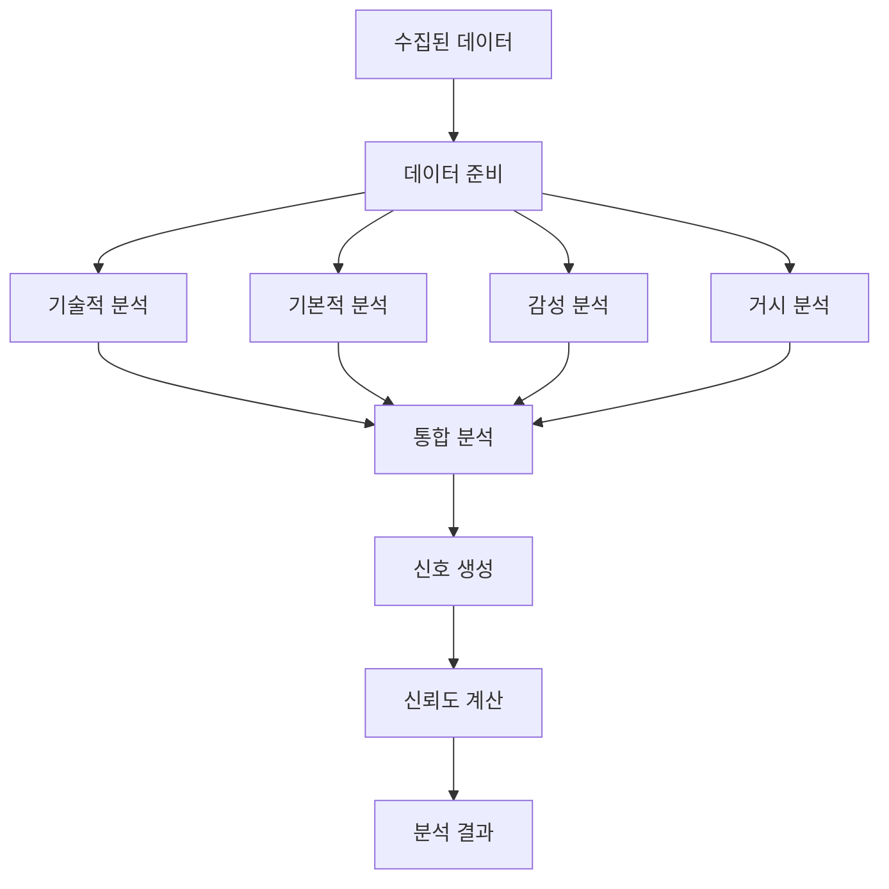

# `src/a2a_agents/analysis` 코드 인덱스

4차원 투자 분석을 담당하는 A2A 에이전트 모듈입니다. Technical, Fundamental, Sentiment, Macro 분석을 통합하여 투자 신호를 생성합니다.

## 📋 Breadcrumb

- 프로젝트 루트: [README.md](../../../README.md)
- 상위로: [a2a_agents](../code_index.md)
- 최상위: [src](../../code_index.md)
- **현재 위치**: `src/a2a_agents/analysis/` - AnalysisAgent A2A 래퍼

## 🗂️ 하위 디렉토리 코드 인덱스

- (하위 디렉토리 없음)

## 📁 디렉토리 트리

```text
analysis/
├── __init__.py                      # 패키지 초기화
├── __main__.py                      # A2A 서버 실행 엔트리포인트
├── analysis_agent_a2a.py            # A2A AnalysisAgent 구현
└── code_index.md                    # 이 문서
```

## 📊 AnalysisAgent A2A 구현

### 🎯 **analysis_agent_a2a.py** - 통합 분석 엔진

#### 주요 기능
```python
async def build_server(app: str, llm: str) -> ASGIApplication:
    """AnalysisAgent A2A 서버 빌드
    
    4차원 분석 엔진을 A2A 프로토콜로 래핑
    
    Args:
        app: 애플리케이션 이름
        llm: LLM 모델 이름 (예: gpt-4-turbo)
    
    Returns:
        A2A 호환 ASGI 애플리케이션
    """
```

#### 핵심 역할
1. **기술적 분석 (Technical)**: 차트 패턴, 지표 분석
2. **기본적 분석 (Fundamental)**: 재무제표, 가치평가
3. **감성 분석 (Sentiment)**: 뉴스, 소셜미디어 감성
4. **거시경제 분석 (Macro)**: 경제지표, 산업 동향

#### LangGraph 통합
```python
from src.lg_agents.analysis_agent import AnalysisAgent
from src.a2a_integration import LangGraphAgentExecutor

# LangGraph AnalysisAgent 래핑
lg_agent = AnalysisAgent()
executor = LangGraphAgentExecutor(
    graph=lg_agent.graph,
    name="analysis",
    description="4-dimensional investment analysis engine",
    config={
        "configurable": {
            "thread_id": "analysis_thread",
            "checkpoint_ns": "analysis"
        }
    }
)
```

### 📈 4차원 분석 시스템

#### 1️⃣ **Technical Analysis** - 기술적 분석

##### 분석 지표
```python
TECHNICAL_INDICATORS = {
    "trend": ["SMA", "EMA", "MACD"],
    "momentum": ["RSI", "Stochastic", "CCI"],
    "volatility": ["Bollinger Bands", "ATR"],
    "volume": ["OBV", "Volume Ratio"],
    "pattern": ["Support/Resistance", "Head & Shoulders"]
}
```

##### 신호 생성
```python
def generate_technical_signal(indicators: Dict) -> str:
    """기술적 지표 기반 신호 생성
    
    Returns:
        STRONG_BUY | BUY | HOLD | SELL | STRONG_SELL
    """
```

#### 2️⃣ **Fundamental Analysis** - 기본적 분석

##### 재무 지표
```python
FUNDAMENTAL_METRICS = {
    "valuation": ["PER", "PBR", "PSR", "EV/EBITDA"],
    "profitability": ["ROE", "ROA", "Operating Margin"],
    "growth": ["Revenue Growth", "EPS Growth"],
    "stability": ["Debt Ratio", "Current Ratio"],
    "efficiency": ["Asset Turnover", "Inventory Turnover"]
}
```

##### 가치 평가
```python
def calculate_fair_value(financials: Dict) -> float:
    """DCF, 멀티플 방식으로 적정 주가 계산
    
    Methods:
    - DCF (Discounted Cash Flow)
    - PER Multiple
    - PBR Multiple
    - Peer Comparison
    """
```

#### 3️⃣ **Sentiment Analysis** - 감성 분석

##### 데이터 소스
- 뉴스 헤드라인 및 본문
- 애널리스트 리포트
- 소셜 미디어 (Twitter, Reddit)
- 공시 및 IR 자료

##### 감성 점수
```python
def calculate_sentiment_score(texts: List[str]) -> float:
    """텍스트 감성 점수 계산
    
    Scale:
    - -1.0: 매우 부정적
    -  0.0: 중립
    - +1.0: 매우 긍정적
    """
```

#### 4️⃣ **Macro Analysis** - 거시경제 분석

##### 분석 요소
```python
MACRO_FACTORS = {
    "economic": ["GDP", "Interest Rate", "Inflation"],
    "market": ["KOSPI", "Dollar Index", "VIX"],
    "industry": ["Sector Performance", "Competition"],
    "policy": ["Monetary Policy", "Fiscal Policy"],
    "global": ["US Market", "China Economy"]
}
```

### 🔄 분석 워크플로우



### 🚀 **__main__.py** - 서버 실행

#### 실행 방법
```bash
# 직접 실행
python -m src.a2a_agents.analysis

# 환경 변수 설정
export A2A_ANALYSIS_PORT=8102
export ANALYSIS_CONFIDENCE_THRESHOLD=0.7
python -m src.a2a_agents.analysis
```

#### 기본 설정
- **포트**: 8102 (기본값)
- **호스트**: localhost
- **신뢰도 임계값**: 0.7

### 📡 A2A 엔드포인트

#### **POST /agent/invoke** - 분석 요청
```json
{
    "stock_code": "005930",
    "analysis_types": ["technical", "fundamental", "sentiment", "macro"],
    "data": {
        "market": {...},
        "financial": {...},
        "news": [...],
        "economic": {...}
    },
    "options": {
        "timeframe": "1M",
        "risk_tolerance": "moderate"
    }
}
```

#### 응답 형식
```json
{
    "status": "success",
    "stock_code": "005930",
    "analysis": {
        "technical": {
            "signal": "BUY",
            "score": 0.75,
            "indicators": {
                "RSI": 45,
                "MACD": "bullish_crossover",
                "SMA20": 68000,
                "volume_trend": "increasing"
            }
        },
        "fundamental": {
            "signal": "STRONG_BUY",
            "score": 0.85,
            "metrics": {
                "PER": 12.5,
                "PBR": 1.2,
                "ROE": 15.3,
                "fair_value": 85000
            }
        },
        "sentiment": {
            "signal": "BUY",
            "score": 0.65,
            "sentiment_score": 0.3,
            "news_count": 25,
            "positive_ratio": 0.6
        },
        "macro": {
            "signal": "HOLD",
            "score": 0.50,
            "factors": {
                "industry_trend": "positive",
                "economic_outlook": "neutral",
                "policy_impact": "negative"
            }
        }
    },
    "recommendation": {
        "action": "BUY",
        "confidence": 0.72,
        "target_price": 82000,
        "stop_loss": 65000,
        "position_size": 0.15,
        "reasoning": "강한 펀더멘털과 기술적 반등 신호"
    },
    "risks": [
        "거시경제 불확실성",
        "단기 변동성 증가 가능"
    ]
}
```

### 🔧 환경 변수 설정

```bash
# 필수 설정
A2A_ANALYSIS_PORT=8102              # A2A 서버 포트
LLM_MODEL=gpt-4-turbo               # 분석용 LLM 모델

# 분석 설정
ANALYSIS_CONFIDENCE_THRESHOLD=0.7    # 최소 신뢰도
ENABLE_ALL_DIMENSIONS=true          # 4차원 분석 모두 활성화
TECHNICAL_WEIGHT=0.3                # 기술적 분석 가중치
FUNDAMENTAL_WEIGHT=0.3              # 기본적 분석 가중치
SENTIMENT_WEIGHT=0.2                # 감성 분석 가중치
MACRO_WEIGHT=0.2                    # 거시 분석 가중치

# MCP 서버 연결
MCP_FINANCIAL_ANALYSIS_URL=http://localhost:8040
MCP_STOCK_ANALYSIS_URL=http://localhost:8041
```

### 📊 신호 통합 시스템

#### 카테고리 기반 신호
```python
class InvestmentSignal(Enum):
    STRONG_BUY = "강력 매수"    # Score > 0.8
    BUY = "매수"               # Score > 0.6
    HOLD = "보유"              # Score 0.4 ~ 0.6
    SELL = "매도"              # Score < 0.4
    STRONG_SELL = "강력 매도"   # Score < 0.2
```

#### 가중평균 계산
```python
def calculate_weighted_signal(signals: Dict[str, Signal]) -> Signal:
    """4차원 신호를 가중평균으로 통합
    
    Formula:
    final_score = Σ(weight_i * score_i) / Σ(weight_i)
    """
```

#### 신뢰도 계산
```python
def calculate_confidence(analysis_results: Dict) -> float:
    """분석 신뢰도 계산
    
    Factors:
    - 데이터 품질 (30%)
    - 신호 일치성 (30%)
    - 분석 완전성 (20%)
    - 시장 상황 (20%)
    """
```

### 🔍 리스크 평가

#### 리스크 요인 분석
- **시장 리스크**: 베타, 변동성
- **유동성 리스크**: 거래량, 스프레드
- **신용 리스크**: 부채비율, 신용등급
- **운영 리스크**: 사업 안정성
- **규제 리스크**: 정책 변화

#### VaR 계산
```python
def calculate_var(returns: List[float], confidence: float = 0.95) -> float:
    """Value at Risk 계산
    
    일정 신뢰수준에서 최대 예상 손실
    """
```

### 🧪 테스팅

#### 유닛 테스트
```bash
pytest tests/a2a_agents/analysis/test_analysis_agent.py
```

#### 백테스팅
```python
async def backtest_analysis():
    """과거 데이터로 분석 정확도 검증"""
    historical_data = load_historical_data()
    predictions = await analyze_historical(historical_data)
    accuracy = calculate_accuracy(predictions, actual_results)
    return accuracy
```

### 📈 성능 메트릭

#### 분석 정확도
- 신호 정확도: 방향성 예측 정확도
- 수익률: 신호 따른 수익률
- 샤프 비율: 위험 조정 수익률

#### 실행 성능
- 평균 분석 시간: < 5초
- 동시 처리 가능: 10개 종목
- 메모리 사용: < 1GB

### 🔗 관련 문서

- [상위: A2A Agents](../code_index.md)
- [LangGraph AnalysisAgent](../../lg_agents/analysis_agent.py)
- [DataCollectorAgent](../data_collector/code_index.md)
- [TradingAgent](../trading/code_index.md)
- [Financial Analysis MCP](../../mcp_servers/financial_analysis_mcp/code_index.md)