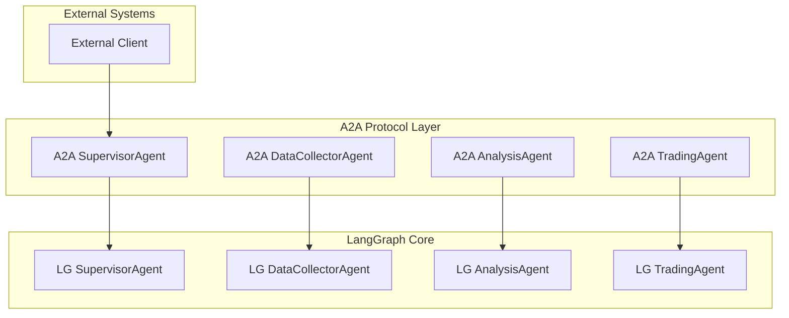

# `src/a2a_agents` 코드 인덱스

A2A(Agent-to-Agent) 프로토콜 기반 에이전트 구현체들을 포함하는 디렉토리입니다. LangGraph 에이전트를 A2A 프로토콜로 래핑하여 외부 시스템과의 통신을 가능하게 합니다.

## 📋 Breadcrumb

- 프로젝트 루트: [README.md](../../README.md)
- 상위로: [src](../code_index.md)
- **현재 위치**: `src/a2a_agents/` - A2A 프로토콜 에이전트

## 🗂️ 하위 디렉토리 코드 인덱스

- [📦 base](base/code_index.md) - 베이스 클래스 및 유틸리티
- [👔 supervisor](supervisor/code_index.md) - 감독자 에이전트
- [📊 data_collector](data_collector/code_index.md) - 데이터 수집 에이전트
- [📈 analysis](analysis/code_index.md) - 분석 에이전트
- [💹 trading](trading/code_index.md) - 거래 실행 에이전트

## 📁 디렉토리 트리

```text
a2a_agents/
├── code_index.md                          # 이 문서
│
├── base/                                  # A2A 기반 클래스
│   ├── __init__.py
│   └── code_index.md
│
├── supervisor/                            # SupervisorAgent A2A 래퍼
│   ├── __init__.py
│   ├── __main__.py                        # 독립 실행 엔트리포인트
│   ├── supervisor_agent_a2a.py            # A2A SupervisorAgent 구현
│   └── code_index.md
│
├── data_collector/                        # DataCollectorAgent A2A 래퍼
│   ├── __init__.py
│   ├── __main__.py                        # 독립 실행 엔트리포인트
│   ├── data_collector_agent_a2a.py        # A2A DataCollectorAgent 구현
│   └── code_index.md
│
├── analysis/                              # AnalysisAgent A2A 래퍼
│   ├── __init__.py
│   ├── __main__.py                        # 독립 실행 엔트리포인트
│   ├── analysis_agent_a2a.py              # A2A AnalysisAgent 구현
│   └── code_index.md
│
└── trading/                               # TradingAgent A2A 래퍼
    ├── __init__.py
    ├── __main__.py                        # 독립 실행 엔트리포인트
    ├── trading_agent_a2a.py               # A2A TradingAgent 구현
    └── code_index.md
```

## 📊 A2A Protocol Architecture

### 🏗️ A2A-LangGraph Integration



## 🤖 A2A Agent 구현

### 공통 구조

각 A2A 에이전트는 다음과 같은 공통 구조를 가집니다:

```python
# A2A 서버 설정
async def build_server(app: str, llm: str) -> ASGIApplication:
    """A2A 서버 빌드"""
    
    # LangGraph 에이전트 초기화
    lg_agent = LangGraphAgent()
    
    # A2A Executor 생성
    executor = LangGraphAgentExecutor(
        graph=lg_agent.graph,
        name="agent_name",
        description="agent_description"
    )
    
    # A2A 서버 생성
    return to_a2a_starlette_server(executor)
```

### 1️⃣ **SupervisorAgent A2A** (`supervisor/supervisor_agent_a2a.py`)

#### 주요 기능
- 사용자 요청 수신 및 파싱
- 워크플로우 계획 및 조정
- 다른 A2A 에이전트 호출
- 결과 종합 및 반환

#### A2A 엔드포인트
```python
POST /agent/invoke
{
    "task": "삼성전자 투자 분석",
    "workflow_pattern": "sequential|parallel",
    "agents": ["data_collector", "analysis", "trading"]
}
```

#### 환경 변수
```bash
A2A_SUPERVISOR_PORT=8100
A2A_SUPERVISOR_HOST=localhost
LLM_MODEL=gpt-4-turbo
```

### 2️⃣ **DataCollectorAgent A2A** (`data_collector/data_collector_agent_a2a.py`)

#### 주요 기능
- 멀티소스 데이터 수집 요청 처리
- 데이터 품질 검증
- 표준화된 데이터 반환

#### A2A 엔드포인트
```python
POST /agent/invoke
{
    "stock_code": "005930",
    "data_types": ["market", "news", "investor"],
    "period": "1M"
}
```

#### 환경 변수
```bash
A2A_DATA_COLLECTOR_PORT=8101
A2A_DATA_COLLECTOR_HOST=localhost
MCP_SERVERS=market_domain,info_domain,investor_domain
```

### 3️⃣ **AnalysisAgent A2A** (`analysis/analysis_agent_a2a.py`)

#### 주요 기능
- 4차원 분석 (Technical, Fundamental, Sentiment, Macro)
- 투자 신호 생성
- 신뢰도 점수 계산

#### A2A 엔드포인트
```python
POST /agent/invoke
{
    "stock_code": "005930",
    "analysis_types": ["technical", "fundamental"],
    "data": {...}  # DataCollectorAgent에서 받은 데이터
}
```

#### 환경 변수
```bash
A2A_ANALYSIS_PORT=8102
A2A_ANALYSIS_HOST=localhost
ANALYSIS_CONFIDENCE_THRESHOLD=0.7
```

### 4️⃣ **TradingAgent A2A** (`trading/trading_agent_a2a.py`)

#### 주요 기능
- 거래 전략 수립
- 포트폴리오 최적화
- 리스크 평가
- Human-in-the-Loop 처리

#### A2A 엔드포인트
```python
POST /agent/invoke
{
    "action": "buy|sell|hold",
    "stock_code": "005930",
    "quantity": 100,
    "analysis_result": {...}  # AnalysisAgent에서 받은 결과
}
```

#### 환경 변수
```bash
A2A_TRADING_PORT=8103
A2A_TRADING_HOST=localhost
HUMAN_IN_LOOP_ENABLED=true
VAR_THRESHOLD=0.05
```

## 🔄 Agent 간 통신

### A2A Protocol 통신 패턴

```python
from src.a2a_integration.a2a_lg_client_utils import query_a2a_agent

# SupervisorAgent에서 DataCollectorAgent 호출
async def collect_data(stock_code: str):
    result = await query_a2a_agent(
        url="http://localhost:8101/agent/invoke",
        payload={
            "stock_code": stock_code,
            "data_types": ["market", "news"]
        }
    )
    return result

# DataCollectorAgent 결과를 AnalysisAgent로 전달
async def analyze_data(data: Dict):
    result = await query_a2a_agent(
        url="http://localhost:8102/agent/invoke",
        payload={
            "data": data,
            "analysis_types": ["technical", "fundamental"]
        }
    )
    return result
```

## 🚀 실행 방법

### 개별 에이전트 실행

```bash
# SupervisorAgent 실행
python -m src.a2a_agents.supervisor

# DataCollectorAgent 실행
python -m src.a2a_agents.data_collector

# AnalysisAgent 실행
python -m src.a2a_agents.analysis

# TradingAgent 실행
python -m src.a2a_agents.trading
```

### 전체 시스템 실행

```bash
# 모든 A2A 에이전트 동시 실행
./run-a2a-agents.sh

# Docker Compose 사용
docker-compose up a2a-agents
```

## 🔧 Configuration

### A2A Agent 설정 파일 (`a2a_config.yaml`)

```yaml
agents:
  supervisor:
    port: 8100
    host: localhost
    llm_model: gpt-4-turbo
    timeout: 60
    
  data_collector:
    port: 8101
    host: localhost
    mcp_servers:
      - market_domain
      - info_domain
      - investor_domain
    
  analysis:
    port: 8102
    host: localhost
    confidence_threshold: 0.7
    
  trading:
    port: 8103
    host: localhost
    human_in_loop: true
    var_threshold: 0.05
```

## 📝 개발 가이드

### 새로운 A2A Agent 추가

1. **디렉토리 생성**
```bash
mkdir src/a2a_agents/new_agent
```

2. **필요 파일 생성**
- `__init__.py`
- `__main__.py`
- `new_agent_a2a.py`
- `code_index.md`

3. **A2A 래퍼 구현**
```python
from src.a2a_integration import LangGraphAgentExecutor
from src.lg_agents.new_agent import NewAgent

async def build_server(app: str, llm: str):
    lg_agent = NewAgent()
    executor = LangGraphAgentExecutor(
        graph=lg_agent.graph,
        name="new_agent",
        description="New Agent Description"
    )
    return to_a2a_starlette_server(executor)
```

## 🧪 테스팅

### 유닛 테스트
```bash
pytest tests/a2a_agents/
```

### 통합 테스트
```bash
pytest tests/integration/a2a/
```

### E2E 테스트
```bash
pytest tests/e2e/a2a_workflow.py
```

## 📊 모니터링

### Health Check 엔드포인트
```
GET /health
```

### Metrics 엔드포인트
```
GET /metrics
```

### 로깅
- 로그 레벨: INFO, DEBUG, ERROR
- 로그 위치: `/var/log/a2a_agents/`

## 🔗 관련 문서

- [LangGraph Agents](../lg_agents/code_index.md)
- [A2A Integration](../a2a_integration/code_index.md)
- [MCP Servers](../mcp_servers/code_index.md)
- [A2A SDK 문서](../../docs/a2a-python_0.3.0.txt)