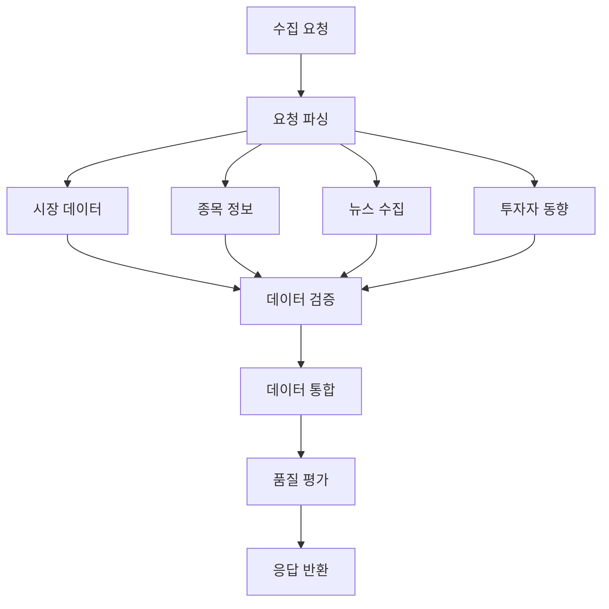

# `src/a2a_agents/data_collector` 코드 인덱스

멀티소스 데이터 수집을 담당하는 A2A 에이전트 모듈입니다. 시장 데이터, 뉴스, 투자자 동향 등을 통합 수집합니다.

## 📋 Breadcrumb

- 프로젝트 루트: [README.md](../../../README.md)
- 상위로: [a2a_agents](../code_index.md)
- 최상위: [src](../../code_index.md)
- **현재 위치**: `src/a2a_agents/data_collector/` - DataCollectorAgent A2A 래퍼

## 🗂️ 하위 디렉토리 코드 인덱스

- (하위 디렉토리 없음)

## 📁 디렉토리 트리

```text
data_collector/
├── __init__.py                          # 패키지 초기화
├── __main__.py                          # A2A 서버 실행 엔트리포인트
├── data_collector_agent_a2a.py          # A2A DataCollectorAgent 구현
└── code_index.md                        # 이 문서
```

## 📊 DataCollectorAgent A2A 구현

### 🎯 **data_collector_agent_a2a.py** - 데이터 수집 오케스트레이터

#### 주요 기능
```python
async def build_server(app: str, llm: str) -> ASGIApplication:
    """DataCollectorAgent A2A 서버 빌드
    
    통합 데이터 수집 에이전트를 A2A 프로토콜로 래핑
    
    Args:
        app: 애플리케이션 이름
        llm: LLM 모델 이름 (예: gpt-4-turbo)
    
    Returns:
        A2A 호환 ASGI 애플리케이션
    """
```

#### 핵심 역할
1. **멀티소스 수집**: 5개 MCP 도메인 서버에서 데이터 수집
2. **데이터 검증**: 수집된 데이터의 품질 및 완전성 검증
3. **표준화**: 다양한 소스의 데이터를 표준 형식으로 변환
4. **품질 평가**: 데이터 품질 점수 계산 (0.0~1.0)

#### LangGraph 통합
```python
from src.lg_agents.data_collector_agent import DataCollectorAgent
from src.a2a_integration import LangGraphAgentExecutor

# LangGraph DataCollectorAgent 래핑
lg_agent = DataCollectorAgent()
executor = LangGraphAgentExecutor(
    graph=lg_agent.graph,
    name="data_collector",
    description="Multi-source data collection orchestrator",
    config={
        "configurable": {
            "thread_id": "data_collector_thread",
            "checkpoint_ns": "data_collector"
        }
    }
)
```

### 📡 데이터 소스 (MCP 서버 연동)

#### 연동 MCP 서버 목록
| MCP 서버 | 포트 | 수집 데이터 |
|---------|------|------------|
| `market_domain` | 8031 | 실시간 시세, 차트, 거래량 |
| `info_domain` | 8032 | 종목 정보, 재무제표, ETF |
| `investor_domain` | 8033 | 기관/외국인 매매 동향 |
| `naver_news_mcp` | 8050 | 뉴스, 공시, 리포트 |
| `tavily_search_mcp` | 3020 | 웹 검색, 소셜 미디어 |

#### 데이터 수집 워크플로우


### 🚀 **__main__.py** - 서버 실행

#### 실행 방법
```bash
# 직접 실행
python -m src.a2a_agents.data_collector

# 환경 변수 설정
export A2A_DATA_COLLECTOR_PORT=8101
export MCP_SERVERS=market_domain,info_domain,investor_domain
python -m src.a2a_agents.data_collector
```

#### 기본 설정
- **포트**: 8101 (기본값)
- **호스트**: localhost
- **타임아웃**: 30초

### 📡 A2A 엔드포인트

#### **POST /agent/invoke** - 데이터 수집 요청
```json
{
    "stock_code": "005930",
    "data_types": ["market", "news", "investor", "financial"],
    "period": "1M",
    "options": {
        "include_intraday": true,
        "news_count": 20,
        "language": "ko"
    }
}
```

#### 응답 형식
```json
{
    "status": "success",
    "stock_code": "005930",
    "data": {
        "market": {
            "current_price": 70000,
            "change_rate": 2.5,
            "volume": 15000000,
            "chart_data": [...],
            "timestamp": "2024-01-20T10:30:00"
        },
        "news": [
            {
                "title": "삼성전자 4분기 실적 발표",
                "content": "...",
                "sentiment": "positive",
                "published_at": "2024-01-20T09:00:00"
            }
        ],
        "investor": {
            "institutional": {
                "net_buy": 1000000,
                "total_volume": 5000000
            },
            "foreign": {
                "net_buy": -500000,
                "total_volume": 3000000
            }
        },
        "financial": {
            "market_cap": 420000000000000,
            "per": 12.5,
            "pbr": 1.2,
            "roe": 15.3
        }
    },
    "data_quality_score": 0.95,
    "metadata": {
        "collection_time": 2.5,
        "sources_used": 5,
        "errors": []
    }
}
```

### 🔧 환경 변수 설정

```bash
# 필수 설정
A2A_DATA_COLLECTOR_PORT=8101        # A2A 서버 포트

# MCP 서버 연결 설정
MCP_MARKET_DOMAIN_URL=http://localhost:8031
MCP_INFO_DOMAIN_URL=http://localhost:8032
MCP_INVESTOR_DOMAIN_URL=http://localhost:8033
MCP_NEWS_URL=http://localhost:8050
MCP_SEARCH_URL=http://localhost:3020

# 데이터 수집 옵션
DATA_COLLECTION_TIMEOUT=30          # 수집 타임아웃 (초)
MAX_NEWS_ITEMS=50                   # 최대 뉴스 수집 개수
ENABLE_CACHE=true                   # 캐싱 활성화
CACHE_TTL=300                       # 캐시 TTL (초)

# 품질 관리
MIN_QUALITY_SCORE=0.7               # 최소 품질 점수
VALIDATE_DATA=true                  # 데이터 검증 활성화
```

### 📊 데이터 품질 평가

#### 품질 점수 계산 기준
```python
def calculate_quality_score(data: Dict) -> float:
    """데이터 품질 점수 계산
    
    평가 기준:
    - 완전성 (30%): 필수 필드 존재 여부
    - 최신성 (25%): 데이터 시간 기준
    - 일관성 (25%): 데이터 간 일치성
    - 정확성 (20%): 이상치 및 오류 검사
    
    Returns:
        0.0 ~ 1.0 사이의 품질 점수
    """
```

#### 품질 임계값
- **0.9 이상**: Excellent - 모든 분석에 적합
- **0.7 ~ 0.9**: Good - 일반 분석 가능
- **0.5 ~ 0.7**: Fair - 제한적 사용
- **0.5 미만**: Poor - 재수집 권장

### 🔄 데이터 수집 전략

#### 순차 수집 (Sequential)
```python
# 의존성이 있는 데이터 순차 수집
market_data = await collect_market_data()
if market_data.volume > threshold:
    investor_data = await collect_investor_data()
```

#### 병렬 수집 (Parallel)
```python
# 독립적인 데이터 병렬 수집
tasks = [
    collect_market_data(),
    collect_news_data(),
    collect_investor_data()
]
results = await asyncio.gather(*tasks)
```

### 🔍 에러 처리

#### 재시도 전략
```python
@retry(max_attempts=3, backoff=2.0)
async def collect_with_retry(source: str):
    """실패 시 exponential backoff로 재시도"""
    try:
        return await collect_from_source(source)
    except MCPConnectionError:
        # Fallback to cached data
        return get_cached_data(source)
```

#### 부분 실패 처리
- 일부 소스 실패 시 가용한 데이터만으로 응답
- 품질 점수에 실패한 소스 반영
- 에러 메타데이터 포함

### 🧪 테스팅

#### 유닛 테스트
```bash
pytest tests/a2a_agents/data_collector/test_data_collector.py
```

#### 통합 테스트
```python
async def test_data_collection():
    response = await query_a2a_agent(
        url="http://localhost:8101/agent/invoke",
        payload={
            "stock_code": "005930",
            "data_types": ["market", "news"]
        }
    )
    assert response["data_quality_score"] >= 0.7
```

### 📈 모니터링

#### 수집 메트릭
- 평균 수집 시간
- 소스별 성공률
- 데이터 품질 점수 분포
- 캐시 히트율

#### Health Check
```bash
curl http://localhost:8101/health
```

### 💾 캐싱 전략

#### 캐시 레이어
1. **메모리 캐시**: 자주 요청되는 데이터 (TTL: 5분)
2. **Redis 캐시**: 중기 데이터 저장 (TTL: 1시간)
3. **데이터베이스**: 히스토리 데이터 영구 저장

#### 캐시 무효화
- 실시간 데이터: 즉시 무효화
- 뉴스/공시: 새 항목 발견 시
- 재무 데이터: 분기별 업데이트

### 🔗 관련 문서

- [상위: A2A Agents](../code_index.md)
- [LangGraph DataCollectorAgent](../../lg_agents/data_collector_agent.py)
- [MCP Servers](../../mcp_servers/code_index.md)
- [SupervisorAgent](../supervisor/code_index.md)
- [AnalysisAgent](../analysis/code_index.md)