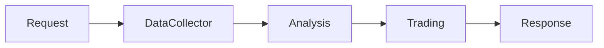
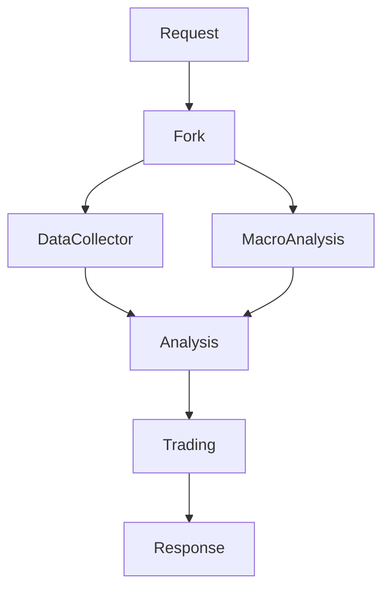

# `src/a2a_agents/supervisor` 코드 인덱스

전체 워크플로우를 조율하는 감독자 A2A 에이전트 모듈입니다. 시스템의 마스터 오케스트레이터 역할을 수행합니다.

## 📋 Breadcrumb

- 프로젝트 루트: [README.md](../../../README.md)
- 상위로: [a2a_agents](../code_index.md)
- 최상위: [src](../../code_index.md)
- **현재 위치**: `src/a2a_agents/supervisor/` - SupervisorAgent A2A 래퍼

## 🗂️ 하위 디렉토리 코드 인덱스

- (하위 디렉토리 없음)

## 📁 디렉토리 트리

```text
supervisor/
├── __init__.py                      # 패키지 초기화
├── __main__.py                      # A2A 서버 실행 엔트리포인트
├── supervisor_agent_a2a.py          # A2A SupervisorAgent 구현
└── code_index.md                    # 이 문서
```

## 📊 SupervisorAgent A2A 구현

### 🎯 **supervisor_agent_a2a.py** - 마스터 오케스트레이터

#### 주요 기능
```python
async def build_server(app: str, llm: str) -> ASGIApplication:
    """SupervisorAgent A2A 서버 빌드
    
    Args:
        app: 애플리케이션 이름
        llm: LLM 모델 이름 (예: gpt-4-turbo)
    
    Returns:
        A2A 호환 ASGI 애플리케이션
    """
```

#### 핵심 역할
1. **요청 파싱**: 사용자 요청 분석 및 의도 파악
2. **워크플로우 계획**: 실행 전략 수립 (순차/병렬)
3. **에이전트 조정**: 다른 A2A 에이전트 호출 및 조율
4. **결과 종합**: 각 에이전트 결과 통합 및 최종 응답 생성

#### LangGraph 통합
```python
from src.lg_agents.supervisor_agent import SupervisorAgent
from src.a2a_integration import LangGraphAgentExecutor

# LangGraph SupervisorAgent 래핑
lg_agent = SupervisorAgent()
executor = LangGraphAgentExecutor(
    graph=lg_agent.graph,
    name="supervisor",
    description="Master orchestrator for investment workflow",
    config={
        "configurable": {
            "thread_id": "supervisor_thread",
            "checkpoint_ns": "supervisor"
        }
    }
)
```

### 🚀 **__main__.py** - 서버 실행

#### 실행 방법
```bash
# 직접 실행
python -m src.a2a_agents.supervisor

# 환경 변수 설정
export A2A_SUPERVISOR_PORT=8100
export LLM_MODEL=gpt-4-turbo
python -m src.a2a_agents.supervisor
```

#### 기본 설정
- **포트**: 8100 (기본값)
- **호스트**: localhost
- **LLM 모델**: gpt-4-turbo

### 🔄 워크플로우 패턴

#### Sequential Pattern (순차 실행)


#### Parallel Pattern (병렬 실행)


### 📡 A2A 엔드포인트

#### **POST /agent/invoke** - 메인 실행 엔드포인트
```json
{
    "task": "삼성전자 투자 분석 및 매수 추천",
    "parameters": {
        "stock_code": "005930",
        "investment_amount": 10000000,
        "risk_level": "moderate"
    },
    "workflow_pattern": "sequential",
    "agents_to_use": ["data_collector", "analysis", "trading"]
}
```

#### 응답 형식
```json
{
    "status": "success",
    "workflow_executed": "sequential",
    "results": {
        "data_collection": {...},
        "analysis": {...},
        "trading": {...}
    },
    "summary": "투자 분석 완료 및 매수 주문 실행",
    "execution_time": 12.5
}
```

### 🔧 환경 변수 설정

```bash
# 필수 설정
A2A_SUPERVISOR_PORT=8100            # A2A 서버 포트
LLM_MODEL=gpt-4-turbo               # 사용할 LLM 모델

# 다른 에이전트 연결 정보
A2A_DATA_COLLECTOR_URL=http://localhost:8101
A2A_ANALYSIS_URL=http://localhost:8102
A2A_TRADING_URL=http://localhost:8103

# 옵션 설정
SUPERVISOR_TIMEOUT=60               # 전체 워크플로우 타임아웃 (초)
ENABLE_PARALLEL_EXECUTION=true      # 병렬 실행 활성화
MAX_RETRIES=3                       # 실패 시 재시도 횟수
```

### 🔗 다른 에이전트와의 통신

```python
from src.a2a_integration.a2a_lg_client_utils import query_a2a_agent

# DataCollectorAgent 호출
async def collect_data(stock_code: str):
    response = await query_a2a_agent(
        url="http://localhost:8101/agent/invoke",
        payload={
            "stock_code": stock_code,
            "data_types": ["market", "news", "investor"]
        }
    )
    return response

# AnalysisAgent 호출
async def analyze_data(data: Dict):
    response = await query_a2a_agent(
        url="http://localhost:8102/agent/invoke",
        payload={
            "data": data,
            "analysis_types": ["technical", "fundamental", "sentiment"]
        }
    )
    return response
```

### 📊 상태 관리

SupervisorAgent는 다음 상태를 관리합니다:

```python
class SupervisorState(TypedDict):
    messages: List[BaseMessage]        # 대화 히스토리
    task: str                          # 현재 작업
    workflow_pattern: str              # 실행 패턴
    agents_called: List[str]           # 호출된 에이전트
    collected_data: Dict[str, Any]     # 수집된 데이터
    analysis_results: Dict[str, Any]   # 분석 결과
    trading_decision: Dict[str, Any]   # 거래 결정
    errors: List[str]                  # 에러 메시지
    execution_metadata: Dict[str, Any] # 실행 메타데이터
```

### 🧪 테스팅

#### 유닛 테스트
```bash
pytest tests/a2a_agents/supervisor/test_supervisor_agent.py
```

#### 통합 테스트
```python
# 전체 워크플로우 테스트
async def test_supervisor_workflow():
    response = await query_a2a_agent(
        url="http://localhost:8100/agent/invoke",
        payload={
            "task": "테스트 투자 분석",
            "stock_code": "005930"
        }
    )
    assert response["status"] == "success"
```

### 📈 모니터링

#### Health Check
```bash
curl http://localhost:8100/health
```

#### Metrics
```bash
curl http://localhost:8100/metrics
```

### 🔍 디버깅

#### 로그 레벨 설정
```bash
export LOG_LEVEL=DEBUG
python -m src.a2a_agents.supervisor
```

#### 로그 위치
- 개발: 콘솔 출력
- 프로덕션: `/var/log/a2a_agents/supervisor.log`

### 🔗 관련 문서

- [상위: A2A Agents](../code_index.md)
- [LangGraph SupervisorAgent](../../lg_agents/supervisor_agent.py)
- [A2A Integration](../../a2a_integration/code_index.md)
- [DataCollectorAgent](../data_collector/code_index.md)
- [AnalysisAgent](../analysis/code_index.md)
- [TradingAgent](../trading/code_index.md)