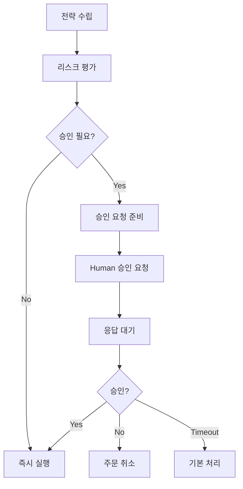

# `src/a2a_agents/trading` 코드 인덱스

Human-in-the-Loop 기반 거래 실행 및 포트폴리오 관리를 담당하는 A2A 에이전트 모듈입니다. 리스크 평가와 주문 실행을 수행합니다.

## 📋 Breadcrumb

- 프로젝트 루트: [README.md](../../../README.md)
- 상위로: [a2a_agents](../code_index.md)
- 최상위: [src](../../code_index.md)
- **현재 위치**: `src/a2a_agents/trading/` - TradingAgent A2A 래퍼

## 🗂️ 하위 디렉토리 코드 인덱스

- (하위 디렉토리 없음)

## 📁 디렉토리 트리

```text
trading/
├── __init__.py                      # 패키지 초기화
├── __main__.py                      # A2A 서버 실행 엔트리포인트
├── trading_agent_a2a.py             # A2A TradingAgent 구현
└── code_index.md                    # 이 문서
```

## 📊 TradingAgent A2A 구현

### 🎯 **trading_agent_a2a.py** - 거래 실행 엔진

#### 주요 기능
```python
async def build_server(app: str, llm: str) -> ASGIApplication:
    """TradingAgent A2A 서버 빌드
    
    Human-in-the-Loop 거래 실행 엔진을 A2A 프로토콜로 래핑
    
    Args:
        app: 애플리케이션 이름
        llm: LLM 모델 이름 (예: gpt-4-turbo)
    
    Returns:
        A2A 호환 ASGI 애플리케이션
    """
```

#### 핵심 역할
1. **전략 수립**: 분석 결과 기반 거래 전략 생성
2. **포트폴리오 최적화**: 자산 배분 및 리밸런싱
3. **리스크 평가**: VaR, 최대 손실 계산
4. **주문 실행**: 매수/매도 주문 실행
5. **Human-in-the-Loop**: 고위험 거래 승인 프로세스

#### LangGraph 통합
```python
from src.lg_agents.trading_agent import TradingAgent
from src.a2a_integration import LangGraphAgentExecutor

# LangGraph TradingAgent 래핑
lg_agent = TradingAgent()
executor = LangGraphAgentExecutor(
    graph=lg_agent.graph,
    name="trading",
    description="Risk-aware trading execution with Human-in-the-Loop",
    config={
        "configurable": {
            "thread_id": "trading_thread",
            "checkpoint_ns": "trading",
            "interrupt_before": ["human_approval"]  # Human 승인 전 인터럽트
        }
    }
)
```

### 💼 거래 전략 시스템

#### 전략 유형
```python
class TradingStrategy(Enum):
    MOMENTUM = "모멘텀 전략"          # 추세 추종
    MEAN_REVERSION = "평균 회귀"      # 과매도/과매수 활용
    VALUE_INVESTING = "가치 투자"     # 저평가 종목 매수
    GROWTH_INVESTING = "성장 투자"    # 고성장 종목 투자
    PAIRS_TRADING = "페어 트레이딩"   # 상관관계 활용
    ARBITRAGE = "차익거래"           # 가격 차이 활용
```

#### 포지션 사이징
```python
def calculate_position_size(
    capital: float,
    risk_per_trade: float,
    stop_loss_pct: float
) -> int:
    """Kelly Criterion 기반 포지션 크기 계산
    
    Kelly % = (p * b - q) / b
    where:
    - p: 승률
    - q: 패률 (1-p)
    - b: 손익비
    """
```

### 🛡️ Human-in-the-Loop 시스템

#### 승인 필요 조건
```python
APPROVAL_TRIGGERS = {
    "high_risk": "VaR > 포트폴리오의 5%",
    "large_position": "단일 종목 > 포트폴리오의 20%",
    "low_confidence": "분석 신뢰도 < 60%",
    "market_volatility": "VIX > 30",
    "first_trade": "신규 종목 첫 거래",
    "stop_loss": "손절 주문",
    "margin_trade": "신용 거래"
}
```

#### 승인 프로세스


### 📈 포트폴리오 최적화

#### Modern Portfolio Theory
```python
def optimize_portfolio(
    assets: List[Asset],
    constraints: Dict
) -> Portfolio:
    """Markowitz 포트폴리오 최적화
    
    목적함수:
    - 최대 샤프 비율
    - 최소 분산
    - 리스크 패리티
    
    제약조건:
    - 최대 종목 수
    - 섹터 집중도
    - 유동성 요구사항
    """
```

#### 리밸런싱 전략
```python
REBALANCING_TRIGGERS = {
    "periodic": "월간/분기별 정기 리밸런싱",
    "threshold": "목표 비중 ±5% 이탈 시",
    "volatility": "시장 변동성 급증 시",
    "correlation": "상관관계 변화 시"
}
```

### 🚀 **__main__.py** - 서버 실행

#### 실행 방법
```bash
# 직접 실행
python -m src.a2a_agents.trading

# 환경 변수 설정
export A2A_TRADING_PORT=8103
export HUMAN_IN_LOOP_ENABLED=true
export VAR_THRESHOLD=0.05
python -m src.a2a_agents.trading
```

#### 기본 설정
- **포트**: 8103 (기본값)
- **호스트**: localhost
- **Human-in-the-Loop**: 활성화
- **VaR 임계값**: 5%

### 📡 A2A 엔드포인트

#### **POST /agent/invoke** - 거래 실행 요청
```json
{
    "action": "execute_trade",
    "stock_code": "005930",
    "trade_type": "buy",
    "quantity": 100,
    "order_type": "limit",
    "price": 70000,
    "analysis_result": {
        "signal": "BUY",
        "confidence": 0.75,
        "target_price": 82000,
        "stop_loss": 65000
    },
    "portfolio_context": {
        "total_capital": 100000000,
        "current_positions": [...],
        "risk_tolerance": "moderate"
    }
}
```

#### 응답 형식
```json
{
    "status": "success",
    "trade_executed": true,
    "order_details": {
        "order_id": "ORD20240120001",
        "stock_code": "005930",
        "type": "buy",
        "quantity": 100,
        "price": 70000,
        "status": "filled",
        "executed_at": "2024-01-20T10:30:00"
    },
    "risk_assessment": {
        "position_risk": 0.03,
        "portfolio_var": 0.048,
        "max_drawdown": 0.15,
        "risk_score": "moderate"
    },
    "portfolio_impact": {
        "new_allocation": {
            "005930": 0.07,
            "cash": 0.30,
            "others": 0.63
        },
        "expected_return": 0.12,
        "portfolio_risk": 0.18,
        "sharpe_ratio": 0.67
    },
    "human_approval": {
        "required": false,
        "reason": null,
        "approved_by": null
    }
}
```

### 🔧 환경 변수 설정

```bash
# 필수 설정
A2A_TRADING_PORT=8103               # A2A 서버 포트

# Human-in-the-Loop 설정
HUMAN_IN_LOOP_ENABLED=true          # Human 승인 활성화
APPROVAL_TIMEOUT=60                 # 승인 대기 시간 (초)
DEFAULT_ACTION_ON_TIMEOUT=reject    # 타임아웃 시 기본 동작

# 리스크 관리
VAR_THRESHOLD=0.05                  # VaR 임계값 (5%)
MAX_POSITION_SIZE=0.20              # 최대 포지션 크기 (20%)
STOP_LOSS_PCT=0.10                  # 손절 비율 (10%)
RISK_PER_TRADE=0.02                 # 거래당 리스크 (2%)

# MCP 서버 연결
MCP_TRADING_DOMAIN_URL=http://localhost:8030
MCP_PORTFOLIO_DOMAIN_URL=http://localhost:8034

# 거래 설정
ENABLE_MARGIN_TRADING=false         # 신용거래 활성화
ENABLE_SHORT_SELLING=false          # 공매도 활성화
MAX_DAILY_TRADES=10                 # 일일 최대 거래 횟수
MIN_ORDER_VALUE=100000              # 최소 주문 금액
```

### 💰 리스크 관리

#### Value at Risk (VaR)
```python
def calculate_var(
    portfolio: Portfolio,
    confidence_level: float = 0.95,
    time_horizon: int = 1
) -> float:
    """포트폴리오 VaR 계산
    
    Methods:
    - Historical VaR
    - Parametric VaR
    - Monte Carlo VaR
    
    Returns:
        최대 예상 손실액
    """
```

#### 리스크 메트릭
```python
RISK_METRICS = {
    "var": "Value at Risk",
    "cvar": "Conditional VaR",
    "max_drawdown": "최대 낙폭",
    "beta": "시장 베타",
    "tracking_error": "추적 오차",
    "information_ratio": "정보 비율"
}
```

#### 손절/익절 전략
```python
class StopStrategy:
    def trailing_stop(self, entry_price: float, current_price: float) -> float:
        """후행 손절 계산"""
        
    def fixed_stop(self, entry_price: float, stop_pct: float) -> float:
        """고정 손절 계산"""
        
    def atr_stop(self, entry_price: float, atr: float, multiplier: float) -> float:
        """ATR 기반 손절 계산"""
```

### 📊 주문 실행

#### 주문 유형
```python
class OrderType(Enum):
    MARKET = "시장가"           # 즉시 체결
    LIMIT = "지정가"            # 가격 지정
    STOP = "스톱"              # 손절 주문
    STOP_LIMIT = "스톱 지정가"   # 손절 지정가
    ICEBERG = "빙산"           # 분할 주문
```

#### 주문 실행 알고리즘
```python
def execute_order(order: Order) -> ExecutionResult:
    """스마트 주문 실행
    
    Algorithms:
    - TWAP (Time Weighted Average Price)
    - VWAP (Volume Weighted Average Price)
    - Implementation Shortfall
    - Iceberg Orders
    """
```

### 🧪 테스팅

#### 백테스팅
```python
async def backtest_strategy(
    strategy: TradingStrategy,
    historical_data: DataFrame,
    initial_capital: float
) -> BacktestResult:
    """전략 백테스팅
    
    Returns:
        - 총 수익률
        - 샤프 비율
        - 최대 낙폭
        - 승률
        - 거래 내역
    """
```

#### 페이퍼 트레이딩
```python
async def paper_trade():
    """모의 거래 모드
    
    실제 자금 없이 전략 테스트
    """
```

### 📈 성능 메트릭

#### 거래 성과
- **수익률**: 절대/상대 수익률
- **샤프 비율**: 위험 조정 수익률
- **승률**: 수익 거래 비율
- **손익비**: 평균 수익/평균 손실

#### 실행 품질
- **슬리피지**: 예상 가격 vs 실제 체결 가격
- **시장 충격**: 대량 주문의 가격 영향
- **체결률**: 주문 대비 체결 비율

### 🔗 관련 문서

- [상위: A2A Agents](../code_index.md)
- [LangGraph TradingAgent](../../lg_agents/trading_agent.py)
- [AnalysisAgent](../analysis/code_index.md)
- [Trading Domain MCP](../../mcp_servers/kiwoom_mcp/domains/trading_domain.py)
- [Portfolio Domain MCP](../../mcp_servers/kiwoom_mcp/domains/portfolio_domain.py)