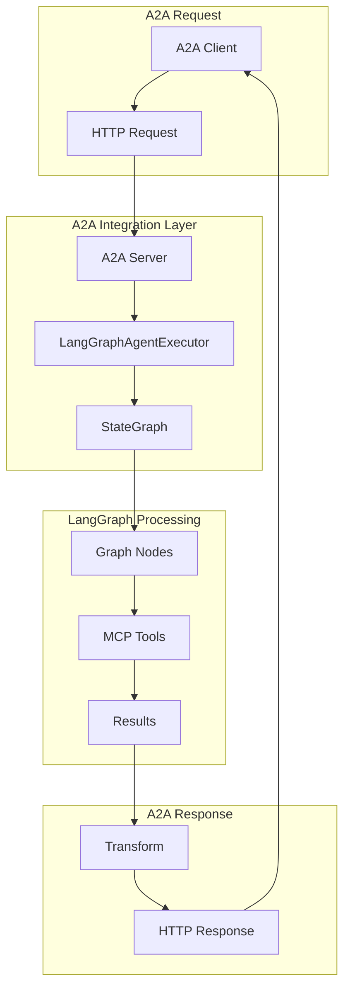

# `src/a2a_integration` 코드 인덱스

A2A 프로토콜과 LangGraph를 연결하는 통합 레이어 모듈입니다. Agent-to-Agent 통신과 StateGraph 실행을 브리징합니다.

## 📋 Breadcrumb

- 프로젝트 루트: [README.md](../../README.md)
- 상위로: [src](../code_index.md)
- **현재 위치**: `src/a2a_integration/` - A2A-LangGraph 브리지

## 🗂️ 하위 디렉토리 코드 인덱스

- **[auth/](auth/)** - 인증 및 자격 증명 관리

## 📁 디렉토리 트리

```text
a2a_integration/
├── __init__.py                      # 패키지 초기화 및 exports
├── executor.py                      # LangGraphAgentExecutor 핵심 실행기
├── generic_executor.py              # GenericAgentExecutor 범용 실행기
├── models.py                        # 설정 모델 정의
├── a2a_lg_client_utils.py          # A2A 클라이언트 유틸리티
├── a2a_lg_utils.py                  # A2A 서버 빌드 유틸리티
├── auth/
│   ├── __init__.py                 # 인증 모듈 초기화
│   └── credentials.py              # 자격 증명 서비스
└── code_index.md                    # 이 문서
```

## 📊 핵심 컴포넌트

### 🎯 **executor.py** - LangGraphAgentExecutor

#### 주요 클래스
```python
class LangGraphAgentExecutor:
    """LangGraph StateGraph를 A2A 프로토콜로 래핑하는 실행기
    
    A2A SDK의 AgentExecutor 인터페이스를 구현하여
    LangGraph 에이전트를 A2A 네트워크에서 사용 가능하게 함
    """
    
    def __init__(
        self,
        graph: StateGraph,
        name: str,
        description: str,
        config: Optional[RunnableConfig] = None
    ):
        """
        Args:
            graph: LangGraph StateGraph 인스턴스
            name: 에이전트 이름
            description: 에이전트 설명
            config: 실행 설정 (thread_id, checkpoint_ns 등)
        """
```

#### 핵심 메서드
```python
async def run(
    self,
    input_data: Dict[str, Any],
    config: Optional[RunnableConfig] = None
) -> AgentResponse:
    """A2A 요청 처리 및 LangGraph 실행
    
    - 입력 데이터를 StateGraph 형식으로 변환
    - 그래프 실행 및 스트리밍 처리
    - 결과를 A2A 응답 형식으로 변환
    """

async def stream(
    self,
    input_data: Dict[str, Any],
    config: Optional[RunnableConfig] = None
) -> AsyncIterator[StreamEvent]:
    """스트리밍 방식으로 그래프 실행
    
    - 실시간 이벤트 스트리밍
    - 중간 결과 전송
    - Human-in-the-Loop 지원
    """
```

### 🔄 **generic_executor.py** - GenericAgentExecutor

#### 특징
```python
class GenericAgentExecutor:
    """범용 A2A 에이전트 실행기
    
    LangGraph 없이 순수 함수 기반으로 동작하는
    심플한 A2A 에이전트 구현
    """
    
    async def execute(
        self,
        task: str,
        context: Dict[str, Any]
    ) -> Dict[str, Any]:
        """범용 작업 실행
        
        - 작업 파싱 및 검증
        - 비즈니스 로직 실행
        - 결과 포맷팅
        """
```

### 📋 **models.py** - 설정 모델

#### 구성 클래스
```python
@dataclass
class LangGraphExecutorConfig:
    """LangGraph 실행기 설정"""
    
    thread_id: str                    # 스레드 식별자
    checkpoint_ns: str                # 체크포인트 네임스페이스
    interrupt_before: List[str]       # 인터럽트 노드
    timeout: int = 300                # 실행 타임아웃
    max_retries: int = 3              # 최대 재시도
    
@dataclass
class A2AConnectionConfig:
    """A2A 연결 설정"""
    
    host: str = "localhost"          # 서버 호스트
    port: int = 8100                 # 서버 포트
    ssl_enabled: bool = False        # SSL 활성화
    api_key: Optional[str] = None    # API 키
```

### 🔌 **a2a_lg_client_utils.py** - 클라이언트 유틸리티

#### A2AClientManager
```python
class A2AClientManager:
    """A2A 클라이언트 연결 관리자
    
    - Connection pooling
    - 자동 재연결
    - 에러 핸들링
    - 요청 재시도
    """
    
    def __init__(
        self,
        base_url: str,
        timeout: int = 30,
        max_retries: int = 3
    ):
        self.session = aiohttp.ClientSession()
        self.retry_policy = ExponentialBackoff()
```

#### 유틸리티 함수
```python
async def query_a2a_agent(
    url: str,
    payload: Dict[str, Any],
    timeout: int = 30
) -> Dict[str, Any]:
    """A2A 에이전트 쿼리
    
    간편하게 A2A 에이전트를 호출하는 헬퍼 함수
    """

async def query_data_a2a_agent(
    agent_url: str,
    stock_code: str,
    data_types: List[str]
) -> Dict[str, Any]:
    """데이터 수집 특화 쿼리
    
    DataCollectorAgent 전용 헬퍼
    """
```

### 🏗️ **a2a_lg_utils.py** - 서버 유틸리티

#### 서버 생성 함수
```python
def to_a2a_starlette_server(
    executor: LangGraphAgentExecutor,
    auth_enabled: bool = False
) -> ASGIApplication:
    """Starlette 기반 A2A 서버 생성
    
    - 라우팅 설정
    - 미들웨어 추가
    - 에러 핸들링
    """

async def to_a2a_run_uvicorn(
    app: ASGIApplication,
    host: str = "0.0.0.0",
    port: int = 8100
):
    """Uvicorn으로 A2A 서버 실행
    
    - 자동 리로드
    - 로깅 설정
    - Graceful shutdown
    """
```

#### AgentCard 생성
```python
def create_agent_card(
    name: str,
    description: str,
    capabilities: List[str],
    version: str = "1.0.0"
) -> AgentCard:
    """A2A 에이전트 메타데이터 생성
    
    - 에이전트 정보
    - 지원 기능
    - API 버전
    """
```

### 🔐 **auth/** - 인증 모듈

#### credentials.py
```python
class A2ACredentialsService:
    """A2A 자격 증명 관리 서비스
    
    - API 키 관리
    - JWT 토큰 처리
    - OAuth2 통합
    - 권한 검증
    """
    
    async def authenticate(
        self,
        credentials: Dict[str, str]
    ) -> AuthToken:
        """사용자 인증"""
        
    async def authorize(
        self,
        token: AuthToken,
        resource: str,
        action: str
    ) -> bool:
        """권한 검증"""
```

## 🔄 통합 워크플로우



## 🎯 사용 예제

### A2A 서버 생성
```python
from src.lg_agents.supervisor_agent import SupervisorAgent
from src.a2a_integration import LangGraphAgentExecutor
from src.a2a_integration.a2a_lg_utils import to_a2a_starlette_server

# LangGraph 에이전트 생성
lg_agent = SupervisorAgent()

# A2A Executor로 래핑
executor = LangGraphAgentExecutor(
    graph=lg_agent.graph,
    name="supervisor",
    description="Master orchestrator"
)

# A2A 서버 생성
app = to_a2a_starlette_server(executor)

# 서버 실행
if __name__ == "__main__":
    import uvicorn
    uvicorn.run(app, host="0.0.0.0", port=8100)
```

### A2A 클라이언트 사용
```python
from src.a2a_integration.a2a_lg_client_utils import query_a2a_agent

# 에이전트 호출
response = await query_a2a_agent(
    url="http://localhost:8100/agent/invoke",
    payload={
        "task": "삼성전자 분석",
        "stock_code": "005930"
    }
)
```

## 🔧 환경 변수

```bash
# A2A 서버 설정
A2A_HOST=0.0.0.0                    # 서버 호스트
A2A_PORT=8100                       # 서버 포트
A2A_SSL_ENABLED=false               # SSL 활성화

# 인증 설정
A2A_AUTH_ENABLED=false              # 인증 활성화
A2A_API_KEY=your-api-key           # API 키
A2A_JWT_SECRET=your-secret         # JWT 시크릿

# 실행 설정
A2A_TIMEOUT=300                     # 요청 타임아웃
A2A_MAX_RETRIES=3                   # 최대 재시도
A2A_LOG_LEVEL=INFO                  # 로그 레벨
```

## 📊 아키텍처 특징

### 단순화된 설계
- **Before**: 17개 파일, 복잡한 추상화
- **After**: 7개 파일, 직관적 구조
- **개선**: 63% 코드 감소, 유지보수성 향상

### SDK 준수
- A2A SDK 인터페이스 직접 구현
- 표준 프로토콜 완벽 지원
- 다른 A2A 에이전트와 호환

### 성능 최적화
- Connection pooling
- 비동기 처리
- 스트리밍 지원
- 캐싱 전략

## 🧪 테스팅

```bash
# 유닛 테스트
pytest tests/a2a_integration/

# 통합 테스트
pytest tests/a2a_integration/test_integration.py

# 성능 테스트
pytest tests/a2a_integration/test_performance.py
```

## 🔗 관련 문서

- [상위: src](../code_index.md)
- [A2A Agents](../a2a_agents/code_index.md)
- [LangGraph Agents](../lg_agents/code_index.md)
- [MCP Servers](../mcp_servers/code_index.md)